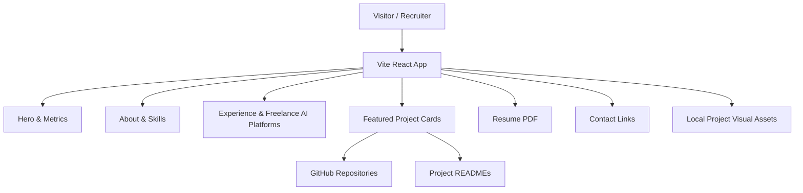

<div align="center">

# 🚀 Taranjyot Singh Portfolio

### Senior Software Engineer & AI Platform Engineer portfolio showcasing production-grade backend, GenAI, MLOps, cloud-native, data, and security systems.

<p>
  
  
  
</p>

<p>
  
  
  
</p>

<p>
  <a href="#-overview">Overview</a> •
  <a href="#-features">Features</a> •
  <a href="#-screenshots">Screenshots</a> •
  <a href="#-architecture">Architecture</a> •
  <a href="#-quick-start">Quick Start</a> •
  <a href="#-troubleshooting">Troubleshooting</a>
</p>

</div>

---

## 📌 Overview

This is a modern personal portfolio built to present a cohesive engineering brand around **AI platform engineering**, **cloud-native backend systems**, **production APIs**, **MLOps workflows**, and **secure software delivery**.

---

## ✨ Features

<table>
<tr>
<td width="33%" valign="top">

### 🧠 AI Platform Positioning

- Senior Software Engineer branding
- AI Platform Engineer headline
- GenAI / RAG / RLHF focus
- Updated resume alignment
- Freelance AI platform section
- Project-based platform wording

</td>
<td width="33%" valign="top">

### 🧩 Portfolio Experience

- Responsive React UI
- Dark-theme friendly design
- Project cards with local visuals
- GitHub / README / resume links
- Recruiter-friendly metrics
- Polished contact section

</td>
<td width="33%" valign="top">

### 🚀 Engineering Quality

- Vite + TypeScript setup
- Tailwind component styling
- Shadcn/Radix UI primitives
- Clean section-based structure
- Local project image assets
- Vercel-ready build workflow

</td>
</tr>
</table>

---

## 🧱 Tech Stack

<div align="center">

<table>
<tr>
<td align="center" width="25%">
<br/>
<b>React</b><br/>
Frontend
</td>
<td align="center" width="25%">
<br/>
<b>TypeScript</b><br/>
Language
</td>
<td align="center" width="25%">
<br/>
<b>Vite</b><br/>
Build Tool
</td>
<td align="center" width="25%">
<br/>
<b>Tailwind CSS</b><br/>
Styling
</td>
</tr>
<tr>
<td align="center">
<br/>
<b>Radix UI</b><br/>
UI Primitives
</td>
<td align="center">
<br/>
<b>GitHub</b><br/>
Repository Links
</td>
<td align="center">
<br/>
<b>Vercel</b><br/>
Deployment
</td>
<td align="center">
<br/>
<b>Portfolio UX</b><br/>
Visual Storytelling
</td>
</tr>
</table>

</div>

---

## 🏗️ Architecture

<div align="center">



</div>

### 🔄 End-to-End Workflow

```text
Visitor Opens Portfolio
        ↓
Hero Communicates Senior Backend + AI Platform Positioning
        ↓
Metrics Establish Experience, Repositories, and Technical Breadth
        ↓
About and Skills Explain Engineering Focus Areas
        ↓
Experience Section Connects Resume, AI Training, and Platform Work
        ↓
Project Cards Link to GitHub Repositories and READMEs
        ↓
Contact Section Routes Visitor to Email, GitHub, LinkedIn, and Resume
```

### System Flow

| Step |                         What Happens                           |
|------|----------------------------------------------------------------|
|  1   | Visitor lands on the hero section                              |
|  2   | Portfolio explains current positioning and core stack          |
|  3   | Skills and experience sections validate technical fit          |
|  4   | Project cards showcase production-style engineering systems    |
|  5   | Recruiter can open GitHub, LinkedIn, resume, or email directly |

---

<details>
<summary><strong>📁 Folder Structure</strong></summary>

```text
portfolio/
├── public/
│   ├── projects/                 # Local project visuals / screenshot placeholders
│   ├── resume.pdf                # Latest resume PDF
│   └── robots.txt
├── src/
│   ├── components/
│   │   ├── portfolio/            # Main portfolio sections
│   │   └── ui/                   # Reusable UI primitives
│   ├── pages/
│   ├── lib/
│   ├── App.tsx
│   ├── main.tsx
│   └── index.css
├── package.json
├── tailwind.config.ts
├── vite.config.ts
└── README.md
```

</details>

---

## ⚡ Quick Start

### Prerequisites

| Requirement |       Version      |
|-------------|--------------------|
| Node.js     | 20+ recommended    |
| npm         | Latest stable      |
| Git         | Any recent version |

### Run Locally

```bash
npm install
npm run dev
```

Open:

```text
http://localhost:5173
```

### Build

```bash
npm run build
```

### Preview Production Build

```bash
npm run preview
```

### Lint

```bash
npm run lint
```

---

## 🧪 What This Project Demonstrates

|       Skill Area     |                         Demonstrated Through                         |
|----------------------|----------------------------------------------------------------------|
| Frontend Engineering | React, TypeScript, responsive sections, reusable components          |
| Personal Branding    | Cohesive Senior Software Engineer + AI Platform Engineer positioning |
| Recruiter UX         | Fast scannability, metrics, project cards, resume and contact links  |
| Project Storytelling | Curated systems with focus, tags, GitHub, and README actions         |
| Design Consistency   | Visual style aligned with polished repository README standards       |
| Deployment Readiness | Vite build flow and Vercel-friendly project structure                |

---

## 🧰 Troubleshooting

<details>
<summary><strong>npm install fails because of Node version</strong></summary>

Use Node.js 20+.

```bash
node -v
```

If needed, switch with `nvm`:

```bash
nvm install 20
nvm use 20
npm install
```

</details>

<details>
<summary><strong>Vite dev server starts but page is blank</strong></summary>

Clear the generated cache and reinstall dependencies:

```bash
rm -rf node_modules dist
npm install
npm run dev
```

</details>

<details>
<summary><strong>Resume download opens old resume</strong></summary>

Replace this file:

```text
public/resume.pdf
```

Then rebuild/redeploy:

```bash
npm run build
```

</details>

<details>
<summary><strong>Project images do not load</strong></summary>

Project cards first try to load real repository screenshots from GitHub raw URLs. If a screenshot is missing in a repository, the card automatically falls back to the local SVG stored in:

```text
public/projects/*.svg
```

To make every card fully screenshot-based, add each project screenshot to its repository under `docs/screenshots/dashboard.png`, or update the image path in:

```text
src/components/portfolio/ProjectsSection.tsx
```

</details>

<details>
<summary><strong>Vercel deployment fails</strong></summary>

Use these settings:

```text
Framework Preset: Vite
Build Command: npm run build
Output Directory: dist
Install Command: npm install
```

</details>

---

## 🔄 Recommended Clean Rebuild

```bash
rm -rf node_modules dist
npm install
npm run lint
npm run build
npm run preview
```

---

## 📄 License

This project is licensed under the [MIT License](LICENSE).
